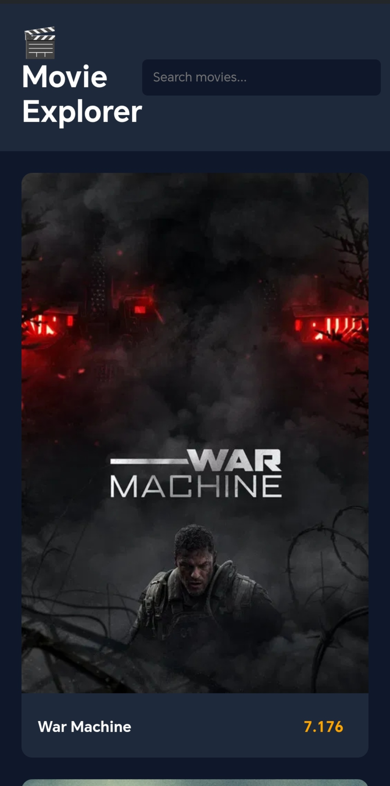
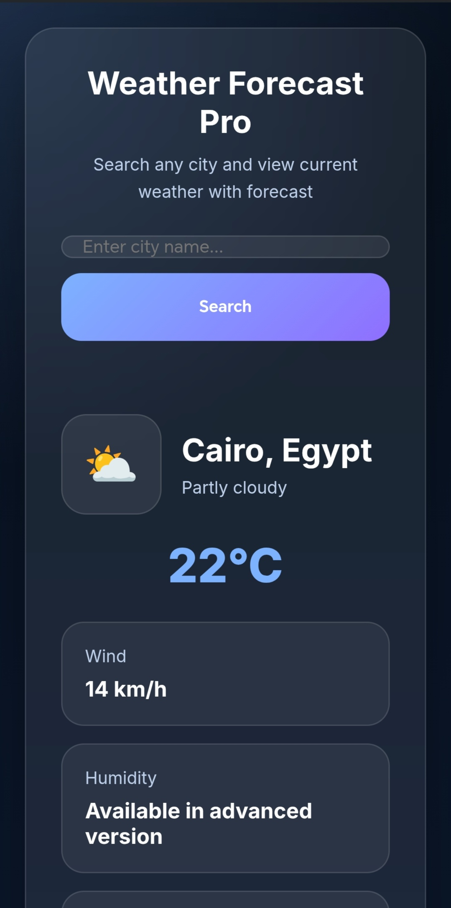

👨‍💻 Eslam Mesalam — Front-End Developer Portfolio

Welcome to my portfolio repository.
This repository showcases my front-end development projects built using modern web technologies like HTML, CSS, and JavaScript.

🌐 Live Portfolio Website
https://semo1682.github.io/eslam-portfolio/

---

🚀 About Me

Hi, I'm Eslam Mesalam
A passionate Front-End Developer from Egypt focused on building modern, responsive, and user-friendly web interfaces.

I enjoy turning ideas into interactive digital experiences using clean and maintainable code.

---

🛠 Skills

- HTML5
- CSS3
- JavaScript
- Responsive Design
- Git & GitHub
- UI / UX Basics

## 📂 المشاريع المميزة

### 🛍 متجر ستايل ميكس

🔗 عرض مباشر  
https://semo1682.github.io/style-mix-store/

---

### 🎬 تطبيق مستكشف الأفلام

🔗 عرض مباشر  
https://semo1682.github.io/movie-explorer-app/

---

### 📊 لوحة معلومات مالية

🔗 عرض مباشر  
https://semo1682.github.io/finance-dashboard-pro/

---

### 🌤 تطبيق الطقس

🔗 عرض مباشر  
https://semo1682.github.io/weather-forecast-pro/

---

### 🖥 لوحة تحكم الادمن

🔗 عرض مباشر  
https://semo1682.github.io/admin-dashboard/

---

### ✅ مدير المهام

---

📫 Contact

📧 Email
eslammesalaam@gmail.com

💼 LinkedIn
https://www.linkedin.com/in/islam-mesalam-47549637a

---

⭐ If you like my work feel free to star the repository.
